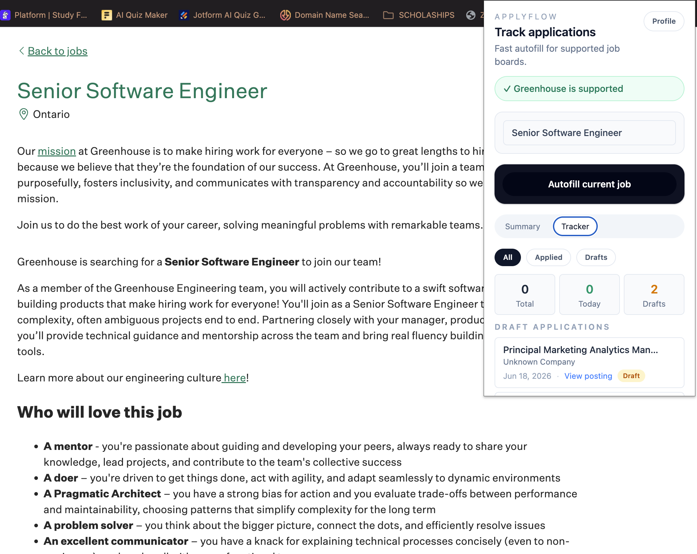

# ApplyFlow

ApplyFlow is a Chrome extension that helps job seekers move through repetitive job applications faster. It stores reusable profile details locally, detects supported application platforms, autofills common fields, attaches saved documents, and keeps a lightweight history of applications.

This project demonstrates my ability to build a real browser-extension workflow with React, Chrome Extension Manifest V3, content scripts, runtime messaging, browser storage, form automation, and test coverage.



## What It Does

- Detects supported job application pages on Greenhouse and Lever
- Autofills common application fields from a saved local profile
- Supports text inputs, email inputs, phone inputs, textareas, selects, custom dropdowns, autocomplete fields, and checkboxes
- Stores resume and optional cover letter PDFs locally for Greenhouse upload flows
- Tracks application history with company, role, URL, date, and status
- Shows a popup dashboard for profile management, platform status, autofill, and application tracking
- Tracks autofill usage statistics locally

## Why I Built It

Applying to jobs often means typing the same information over and over across different hiring platforms. ApplyFlow is designed as a productivity tool, not an automated job-application bot. The user stays in control: they open an application, review the page, and trigger autofill from the extension popup.

The project focuses on practical frontend engineering problems:

- Building a Chrome extension with separate popup, content, and background contexts
- Coordinating data through Chrome runtime messaging
- Handling dynamic React-based application forms
- Filling real-world form controls that do not always behave like plain HTML inputs
- Persisting user data without a backend
- Keeping the UI compact and useful inside an extension popup

## Tech Stack

- React 19
- Vite
- Tailwind CSS
- Chrome Extension Manifest V3
- `@crxjs/vite-plugin`
- Chrome `storage`, `activeTab`, and `scripting` APIs
- Zod for profile validation
- Node test runner with jsdom

## Project Structure

```txt
src/
├── adapters/      Platform adapters for Greenhouse and Lever
├── background/    Extension service worker
├── components/    Reusable popup UI components
├── content/       Content scripts, page lifecycle, and submission handling
├── hooks/         React hooks for profile, platform, autofill, and history state
├── popup/         Extension popup dashboard
├── storage/       Browser storage helpers
├── types/         Message contracts
└── utils/         Autofill, field detection, validation, and metadata utilities
```

## Key Features

### Smart Autofill

The autofill engine maps saved profile data to fields found on the current application page. It uses browser events that mimic user interaction so modern frameworks can detect changes correctly.

It handles:

- Native text inputs and textareas
- Native select fields
- Custom select widgets
- Combobox and autocomplete fields
- Checkbox-style fields
- Validation-aware retry behavior for dropdowns

### Platform Detection

ApplyFlow detects whether the active tab is on a supported platform and surfaces that status inside the popup before the user runs autofill.

Supported platforms:

- Greenhouse
- Lever

### Resume and Cover Letter Storage

Users can upload a resume PDF and optional cover letter PDF once. The files are stored through `chrome.storage.local` and reused during supported application flows.

### Application Tracker

The popup includes a simple dashboard for reviewing applications. Users can filter between all applications, applied applications, and drafts.

Tracked fields include:

- Company
- Role
- Application URL
- Application date
- Status

### Local-First Data Model

ApplyFlow does not require a backend for the current MVP. Profile data, application history, uploaded document data, and autofill statistics are stored locally in the browser.

## Getting Started

Install dependencies:

```bash
npm install
```

Run the development server:

```bash
npm run dev
```

Build the extension:

```bash
npm run build
```

Run tests:

```bash
npm test
```

Run linting:

```bash
npm run lint
```

## Loading the Extension in Chrome

1. Run `npm run build`.
2. Open `chrome://extensions`.
3. Enable Developer Mode.
4. Click "Load unpacked".
5. Select the generated `dist` folder.

## Current Status

ApplyFlow is an MVP focused on reliable autofill and application tracking for Greenhouse and Lever. Future improvements could include broader platform support, encrypted sync, richer analytics, and more advanced document handling.

## What This Project Shows

- Chrome extension architecture with Manifest V3
- React popup UI design for constrained browser-extension space
- Content-script automation against third-party web apps
- Local persistence with Chrome storage APIs
- Form field detection and autofill logic
- Testable utility and storage layers
- Product thinking around user control, privacy, and workflow speed
